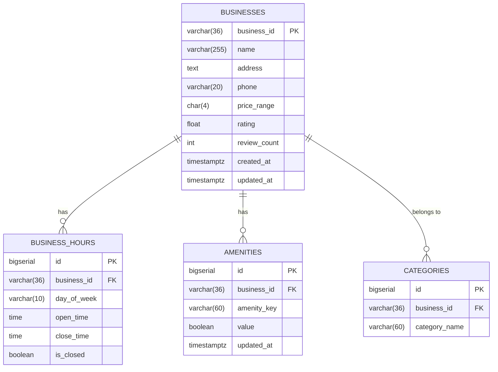
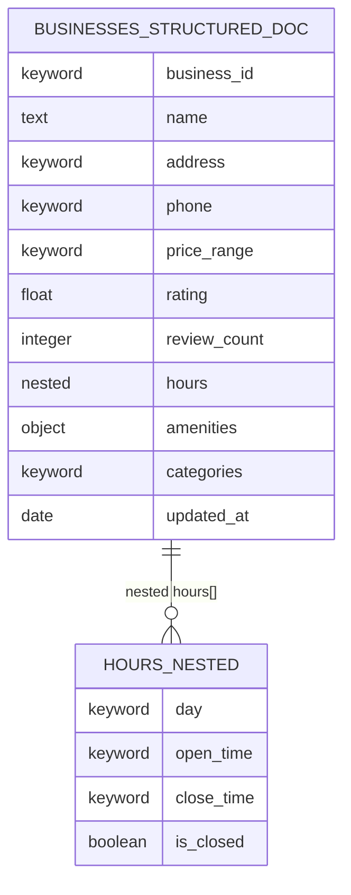
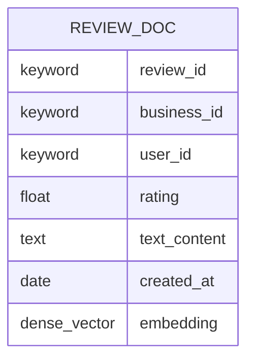
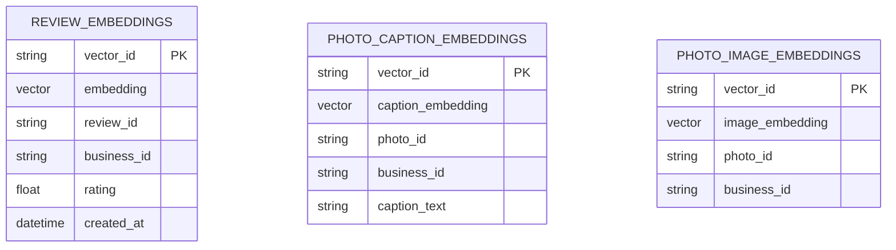
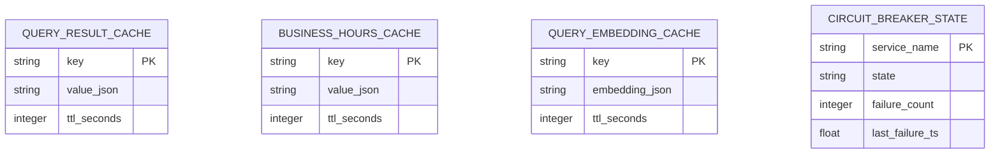
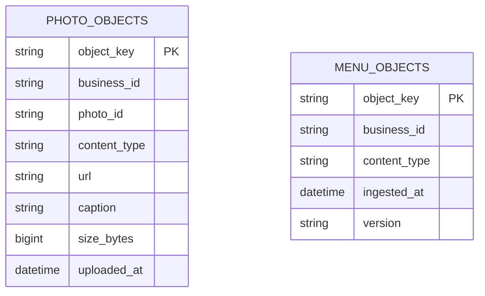
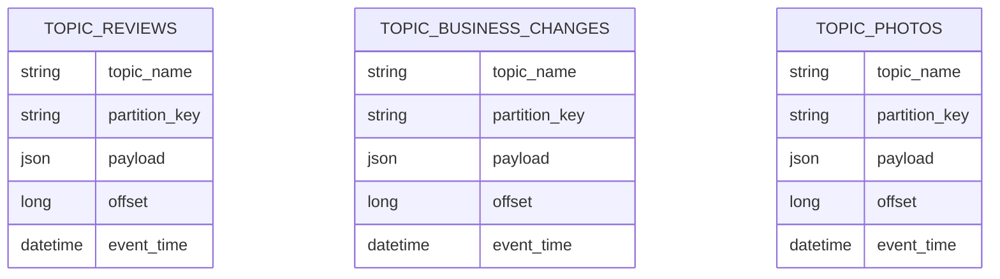

# Database Schema Diagrams

All data stores used by the Yelp-Style AI Assistant, with Mermaid ERD notation.

---

## 1. PostgreSQL — Structured (Authoritative) Store

This is the **single source of truth** for all canonical business fields.
No review or photo data is written here; writes are performed only by the
business-owner portal and the CDC event bus.

### Key indexes

| Table            | Index                                          | Purpose                          |
|------------------|------------------------------------------------|----------------------------------|
| `businesses`     | `PK (business_id)`                             | Direct lookup                    |
| `business_hours` | `(business_id, day_of_week)`                   | Hours-by-day fast path           |
| `amenities`      | `(business_id, amenity_key)` UNIQUE            | Point lookup per amenity         |
| `businesses`     | `GIN (to_tsvector(name \|\| ' ' \|\| address))`| Full-text search                 |

---

## 2. Elasticsearch — Hot Indices

Two separate indices follow the structured / unstructured data separation
rule (TDD §3).

### 2a. Structured Index (`businesses_structured`)

### 2b. Review Text Index (`reviews_text`)

> `embedding` is a 384-dimension `dense_vector` field (sentence-transformers
> `all-MiniLM-L6-v2`) used for kNN approximate nearest-neighbour search.

---

## 3. Vector Database (FAISS / Pinecone)

Two separate namespaces/collections keep review and photo embeddings isolated.

> Review embeddings use a 384-d sentence model.  
> Photo caption embeddings use the same model for text.  
> Photo image embeddings use CLIP (`ViT-B/32`, 512-d) for visual similarity.

---

## 4. Redis — Cache Store

Three logical key spaces with separate TTLs (TDD §10.2).

### Key naming conventions

| Key space                | Pattern                                   | TTL         |
|--------------------------|-------------------------------------------|-------------|
| Query result cache       | `qr:{business_id}:{query_hash}`           | 5 min       |
| Business hours cache     | `hours:{business_id}`                     | 5 min       |
| Query embedding cache    | `emb:{query_hash}`                        | 30 min      |
| Circuit breaker state    | `cb:{service_name}`                       | No expiry   |

---

## 5. Object Storage (S3-compatible) — Unstructured Content

---

## 6. Kafka Topics — Streaming Event Bus

| Topic                  | Partitions | Replication | Retention |
|------------------------|-----------|-------------|-----------|
| `reviews`              | 32        | 3           | 7 days    |
| `business-changes`     | 16        | 3           | 30 days   |
| `photos`               | 16        | 3           | 7 days    |
