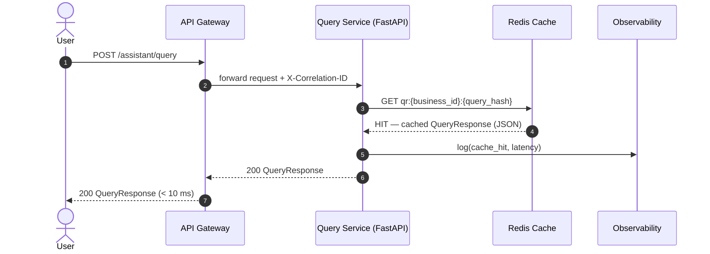
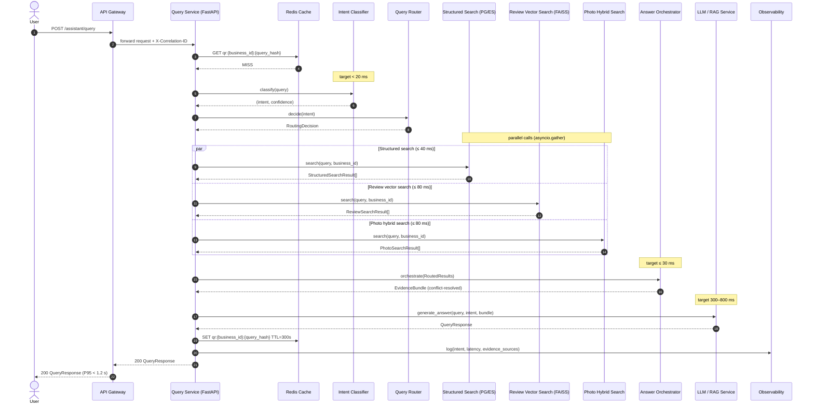
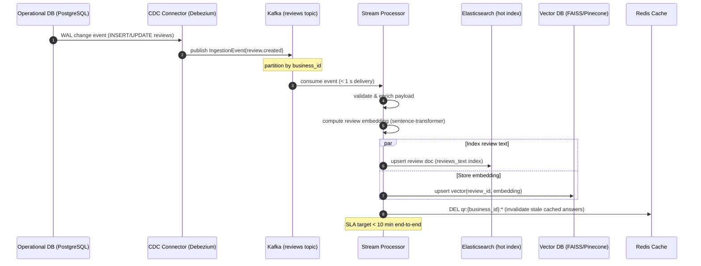
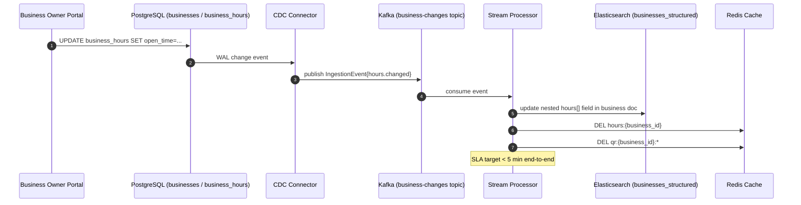
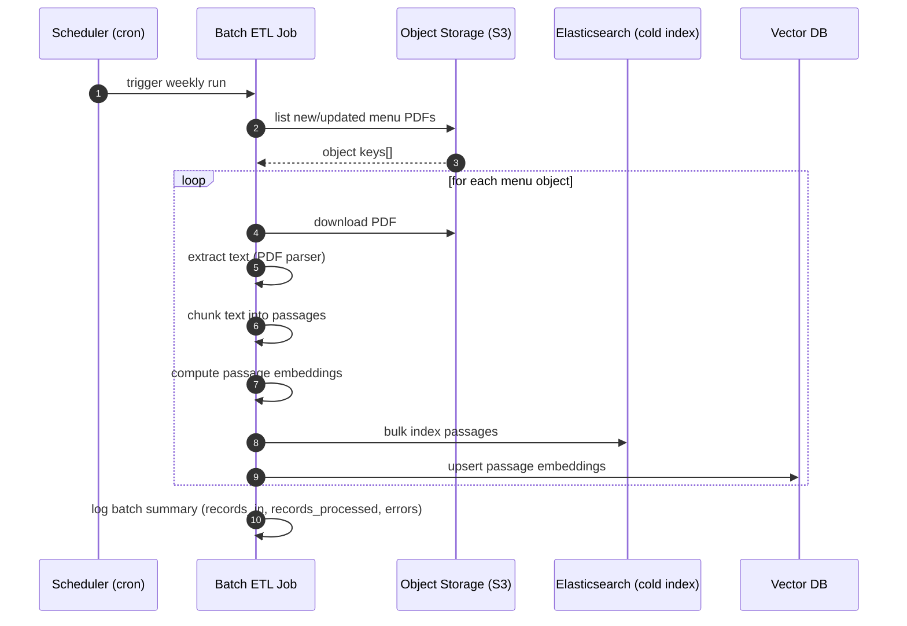
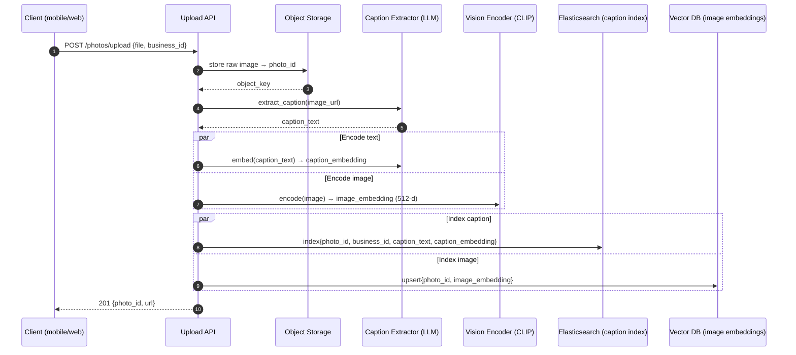

# Sequence Diagrams

All major data flows in the Yelp-Style AI Assistant, annotated with
latency budgets from TDD §8.2.

---

## 1. Query Flow — Cache Hit (happy path, < 10 ms)

When the same query has been answered recently, the result is served
directly from Redis L1 cache with no downstream calls.



---

## 2. Query Flow — Full Pipeline (cache miss, < 1.2 s)

The standard end-to-end path on a cache miss, with parallel search calls
and graceful fallback if the vector DB times out.



---

## 3. Query Flow — Vector DB Timeout Fallback

When the vector/LLM service exceeds its timeout, the system degrades
gracefully to a structured-data-only answer rather than returning an error.

```mermaid
sequenceDiagram
    autonumber
    actor       User
    participant QS   as Query Service
    participant CB   as Circuit Breaker
    participant SS   as Structured Search
    participant RVS  as Review Vector Search
    participant LLM  as LLM / RAG Service
    participant AO   as Answer Orchestrator

    User->>QS: POST /assistant/query
    QS->>SS: search(query, business_id)
    SS-->>QS: StructuredSearchResult[]

    QS->>CB: call(review_vector_search)
    CB->>RVS: search(query, business_id)
    Note over CB,RVS: timeout after 80 ms
    RVS--xCB: TimeoutError
    CB-->>QS: [] (empty — circuit OPEN)
    Note over CB: failure_count++; enter OPEN state

    QS->>AO: orchestrate(structured_only)
    AO-->>QS: EvidenceBundle (structured only)

    QS->>CB: call(llm_service)
    CB->>LLM: generate_answer(...)
    Note over CB,LLM: timeout after 1000 ms
    LLM--xCB: TimeoutError
    CB-->>QS: fallback answer

    Note over QS: return structured-only answer
    QS-->>User: 200 QueryResponse (structured fallback, low confidence)
```

---

## 4. Streaming Ingestion — Review CDC Pipeline

A new or updated review flows from the operational DB through Kafka into the
hot search indices within the 10-minute SLA.



---

## 5. Streaming Ingestion — Business Hours Change

An hours update must propagate to the hot index within 5 minutes.



---

## 6. Batch Ingestion — Weekly Menu ETL

Low-velocity static content processed on a weekly schedule.



---

## 7. Photo Upload — Multimodal Indexing Pipeline

A photo upload triggers caption extraction, CLIP encoding, and dual indexing.



---

## 8. Cache Warm-up on Service Start

At startup (or after a deploy), the service pre-warms caches for the most
popular businesses to absorb the initial request spike.

```mermaid
sequenceDiagram
    autonumber
    participant SVC  as Query Service (startup)
    participant PG   as PostgreSQL
    participant ES   as Elasticsearch
    participant Cache as Redis Cache

    Note over SVC: lifespan startup hook
    SVC->>PG: SELECT business_id FROM businesses ORDER BY review_count DESC LIMIT 500
    PG-->>SVC: top_500_business_ids[]

    loop for each popular business
        SVC->>PG: fetch structured data + hours
        SVC->>Cache: SET hours:{business_id} TTL=300s
    end

    Note over SVC: cache warm-up complete; ready to serve
```
